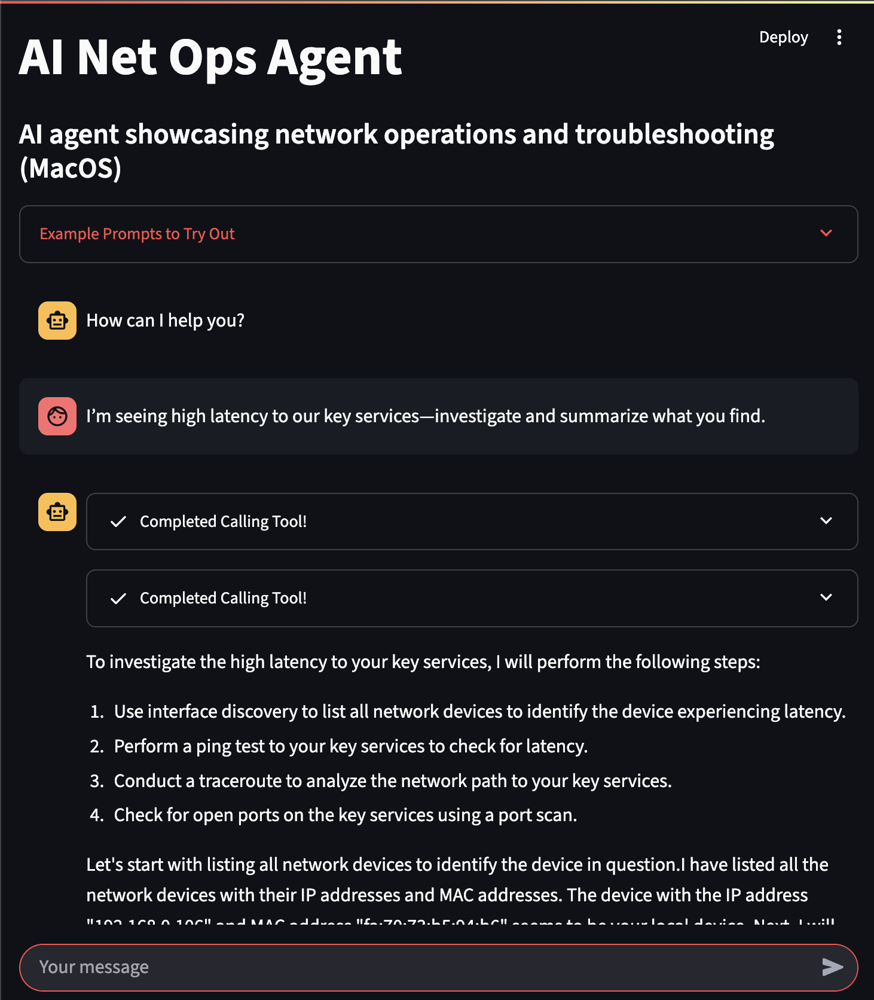

## Prerequisites

* Python 3.13 or higher installed
* Git installed

## Getting Started

Follow these steps to set up the project locally:

### 1. Clone the repository

```bash
git clone https://github.com/bcanfield/ai-net-ops-agent.git
cd ai-net-ops-agent
```

### 2. Create a virtual environment

It's best practice to use a virtual environment to manage dependencies.

```bash
python3 -m venv venv
# On Windows
venv\Scripts\activate
# On macOS/Linux
source venv/bin/activate
```

### 3. Install dependencies

With the virtual environment activated, install the required packages:

```bash
pip install -r requirements.txt
```

### 4. Run the application

```bash
streamlit run app.py
```

## Ways to enhance this
- Support multiple providers
- Persist storage
